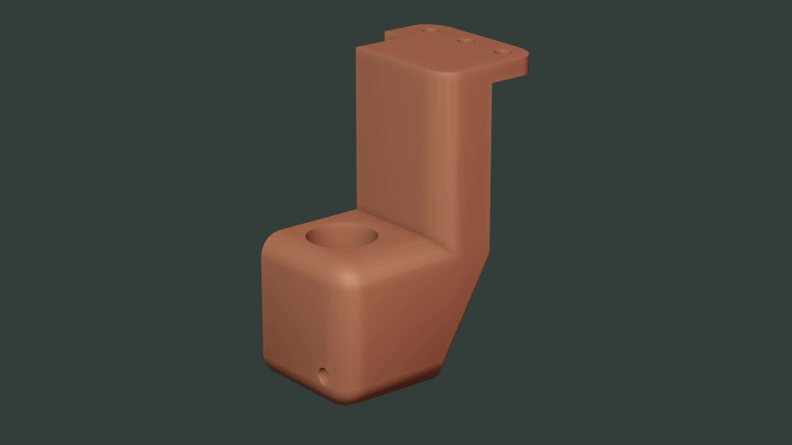

Maker Media GmbH

***

# Neue Aufgabe für alte 3D-Drucker: Umbau zum Schneidplotter

**Der alte 3D-Drucker  nähert sich dem Rentenalter. Aber das ist noch lange kein Grund für den Ruhestand. Was außer 3D-Drucken solche Oldtimer oder auch aktuelle Printer noch können, erfahren Sie in der Make-Ausgabe 3/21 ab Seite 18.**

Hier gibt es jetzt speziell die Druckvorlage eines speziellen Schleppmesserhalters für den Creality Ender3 zum Download: Diese ist mit unserer in Make 6/19, S. 110 gezeigten Modifikation zum [Nachrüsten des BLTouch-Levelsensors](https://www.heise.de/select/make/2019/6/1577126022001664) kompatibel.

Für weitere eigene Modifikationen (etwa den Bohrungsdurchmesser) steht auch eine Blender-Datei zur Verfügung, die kompatibel mit Blender 2.8 und neuer ist. Hier sind alle Bohrungen als Booleans angelegt und können deshalb vor dem Export in den Maßen angepasst werden. Zur Orientierung enthält die Blender-Datei auch die [Halterung für den Touch-Sensor](https://github.com/Make-Magazin/Creality-Sensor) aus dem vorigen Umbau.

Den ausführlichen Artikel zum [Umbau eines 3D-Druckers zum Schneideplotter](https://www.heise.de/select/make/2021/3/2034910430487590861) gibt es in der Make-Ausgabe 3/21 ab Seite 18 zu lesen.
